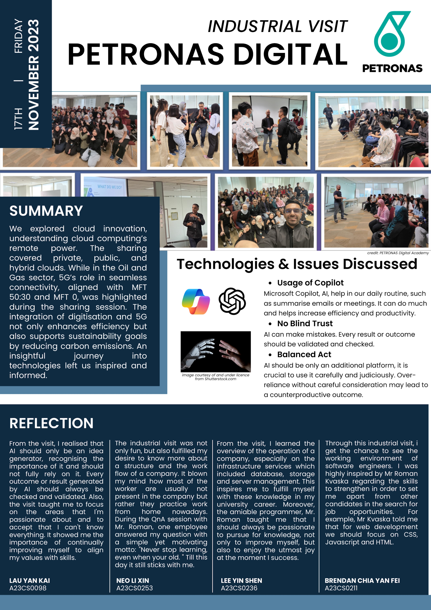
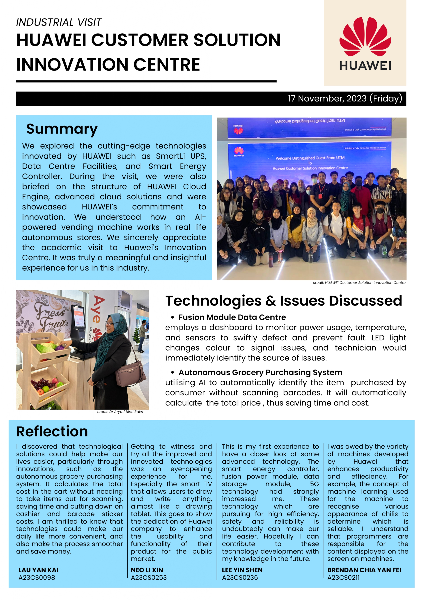

## Newsletter

## Reflection
- Reflection(visitation to PETRONAS)
  - From the visit, I learned the overview of the operation of a company, especially on the infrastructure services which included database, storage and server management. This inspires me to fulfill myself with these knowledge in my university career. Moreover, the amiable programmer, Mr. Roman taught me that I should always be passionate to pursue for knowledge, not only to improve myself, but also to enjoy the utmost joy at the moment I success.
  

- Reflection(visitation to HUAWEI)
  - This is my first experience to have a closer look at some advanced technology. The smart energy controller, fusion power module, data storage module, 5G technology had strongly impressed me. These technology which are pursuing for high efficiency, safety and reliability is undoubtedly can make our life easier. Hopefully I can contribute to these technology development with my knowledge in the future.

