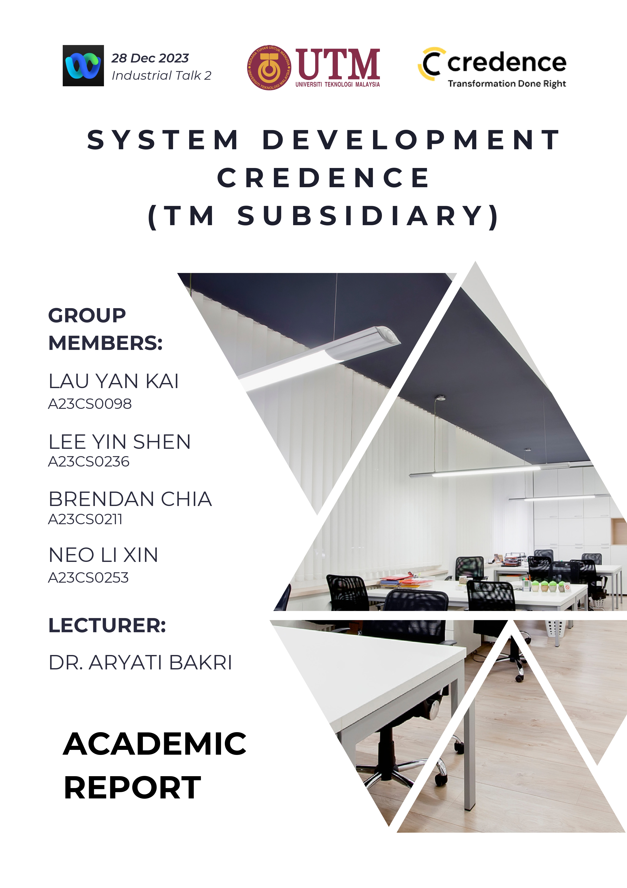
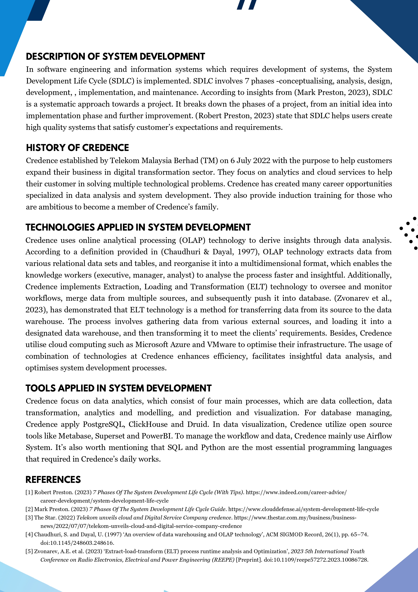
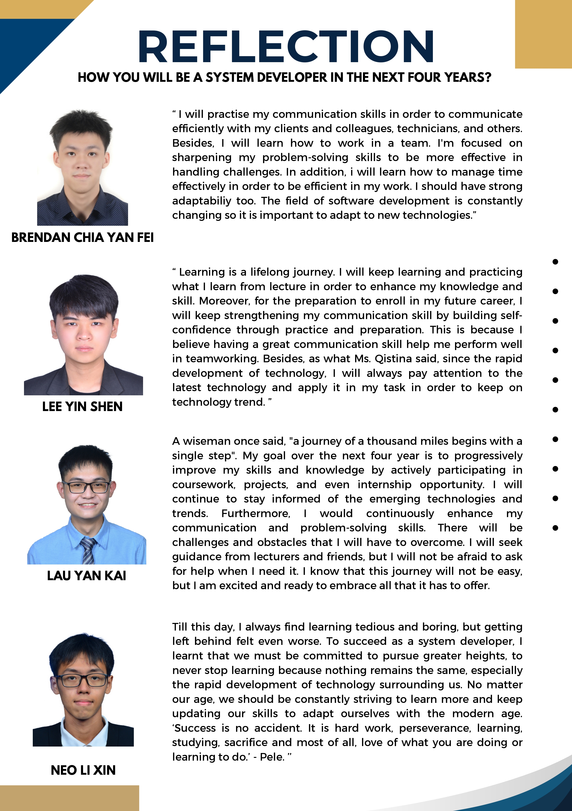

## Academic Report

## Reflection
- Learning is a lifelong journey. I will keep learning and practicing what I learn from lecture in order to enhance my knowledge and skill. Moreover, for the preparation to enroll in my future career, I will keep strengthening my communication skill by building self-confidence through practice and preparation. This is because I believe having a great communication skill help me perform well in teamworking. Besides, as what Ms. Qistina said, since the rapid development of technology, I will always pay attention to the latest technology and apply it in my task in order to keep on technology trend. 

